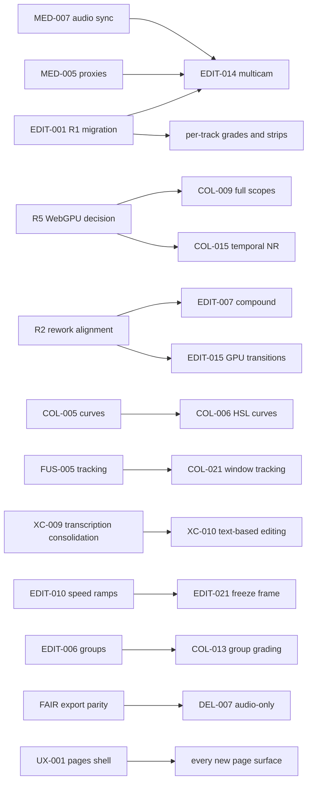

# 30 — Phased Plan

## 1. Phasing principles

1. **Balanced across the four pillars every phase** — each phase ships visible progress in Color, Audio, Edit, and Deliver rather than dedicating a quarter to one area. Two exceptions with rationale:
   - **Phase 0 is UX/foundation-only**: everything after it renders inside the pages shell and the token system — doing tokens first prevents re-skinning every new panel twice.
   - **Phase 2 is anchored by the timeline data-model migration (R1)**: the other pillars run *non-timeline-touching* items in parallel (renderer/audio/export layers) to minimize merge collision.
2. **Renderer work stays thin until R2 is answered**: Phases 0–1 limit renderer changes to *additive registry entries*; any `L`-sized renderer item requires alignment with the binary-rendering rework first.
3. **Dormant features ship first**: EDIT-012 (caption animation) and EDIT-016 (auto-reframe) are already built and only need wiring — they headline Phase 1.

## 2. Phases

### Phase 0 — "Shell, tokens, debt paydown"

*Theme: build the house before moving in furniture.* No renderer work.

- **UX shell**: UX-001…007 (pages shell with Edit = today's layout verbatim; Media/Deliver page rearrangements of existing features)
- **Tokens**: UX-010…019 (scales, surfaces, Button, gradient, toasts, sweep, lint)
- **Research**: UX-020 card sort (pre-build) → UX-021 usability round (gate)
- **Cleanup**: XC-014 backend Gemini-default fix; XC-005 page-switch actions; MED-001 pool relocation
- **Exit criteria**: flag-on shell passes the [22 §4](./22-ux-research.md) gate (≥80% task success, ≥70% first-click, SUS ≥68); zero hardcoded colors outside token files; a user who never leaves Edit sees no change.

### Phase 1 — "Four-pillar MVPs"

*Theme: one hero per pillar; end J2's forced exit to other tools.*

- **Color**: COL-001/002/004 (grading substrate + wheels + contrast/sat/temp) · COL-009 waveform + histogram (WebGPU-gated w/ CPU fallback)
- **Audio**: FAIR-001 mixer v1 · FAIR-002 pan · FAIR-007 meters
- **Edit**: EDIT-002 roll/slip/slide · EDIT-005 markers · **EDIT-012 caption animation wiring** · **EDIT-016 auto-reframe wiring** · EDIT-026 safe areas · EDIT-015 transition batch 1
- **Deliver**: DEL-001 render queue · DEL-002 AV1/advanced options · DEL-004 custom presets · DEL-008 quick export polish
- **Exit criteria**: journey **J2 completable end-to-end at basic quality** (grade + mix + deliver without leaving StreamCuts); Eli queues 5 shorts with animated captions and walks away.

### Phase 2 — "Timeline foundations"

*Theme: pay the structural debt while other pillars work in parallel layers.*

- **Anchor**: EDIT-001 multi-main-track migration (R1 spike → execute; storage migration ~#35) · EDIT-024 track locking · EDIT-025 linked clips
- **Color (renderer-layer, parallel)**: COL-005 curves · COL-008 LUTs
- **Audio (audio-layer, parallel)**: FAIR-003 fades/crossfades · FAIR-004 EQ
- **Deliver/Media (backend, parallel)**: DEL-003 pro-codec transcode · MED-005 proxies v1
- **Exit criteria**: uniform video tracks with transitions/ripple everywhere; a `.cube` LUT applies and exports; ProRes lands via backend.

### Phase 3 — "Grading & mixing depth"

- **Color**: COL-003 log wheels · COL-006 HSL curves · COL-007 qualifier · COL-010 power windows · COL-009 parade + vectorscope · COL-011 serial node stack · COL-012 gallery/stills · COL-020 compare · first COL-016 creative FX
- **Audio**: FAIR-005 dynamics · FAIR-006 buses · FAIR-008 loudness (LUFS) · FAIR-009 automation lanes
- **Edit**: EDIT-006 groups · EDIT-007 compound clips · EDIT-019 adjustment clips (kill the placeholder) · EDIT-020 generators · EDIT-027 paste attributes · CUT-003 smart edit commands
- **Deliver/Media**: DEL-005 range render · DEL-006 burn-in captions · DEL-007 audio-only · MED-003 metadata · MED-012 stills
- **Exit criteria**: secondary grades with tracked-free windows; a bused mix hitting −14 LUFS; compound clips nest and render.

### Phase 4 — "Motion, interchange, intelligence"

- **Fusion-lite**: FUS-001 effect stack · FUS-002 chroma key · FUS-003 roto · FUS-005 point tracking (→ COL-021 window tracking)
- **Edit**: EDIT-010 speed ramps · EDIT-021 freeze frame · EDIT-011 stabilization · EDIT-014 multicam v1 · EDIT-004 dynamic trim · EDIT-008 takes · EDIT-022 match frame · EDIT-017 title templates · CUT-001 source tape · CUT-002 fast review
- **Color**: COL-015 spatial NR
- **AI/interchange**: XC-003 OTIO · XC-009 transcription consolidation (R7) → XC-010 text-based editing · MED-008 scene detection · MED-007 audio sync · MED-002 smart bins · MED-004 storage browser · MED-006 optimized media · FAIR-010 voice isolation
- **Deliver**: DEL-009 render-in-place · DEL-010 background-render spike
- ⚠ Largest phase — expect to split into 4a (motion/edit) and 4b (AI/interchange) at re-roll.

### Phase 5 — "Ecosystem & stretch"

- XC-004 scripting/local automation API · XC-007 dual-monitor · COL-011 parallel/layer nodes · COL-013 group grading · COL-014 color-management statement→implementation · FAIR-013 worklet effects rack · FUS-008 motion titles · FUS-010 templates · FUS-012 optical-flow retime · MED-009 archive/relink
- **Explicit re-triage** of remaining XL/XXL against reality: Fusion patch-graph UI, XC-013 model-heavy AI (Magic Mask class), collaboration (R6), DEL-011 direct upload.

## 3. Dependency graph

## 4. Effort roll-up (dev-weeks, midpoint estimates; solo dev + AI)

| Phase | Color | Audio | Edit | Deliver/Media | UX/XC | ~Total |
|---|---|---|---|---|---|---|
| 0 | — | — | — | 0.5 | 12–16 | **13–17** |
| 1 | 7–9 | 5–7 | 6–8 | 3–4 | — | **21–28** |
| 2 | 6–8 | 3–5 | 12–15 | 7–9 | — | **28–37** |
| 3 | 10–13 | 6–8 | 8–11 | 3–5 | — | **27–37** |
| 4 | 4–6 | 4–5 | 18–24 | 6–8 | 8–11 | **40–54** ⚠ split at re-roll |
| 5 | 6–9 | 2 | — | 2 | 8–11 | **18–24** |

Phase 0 is deliberately short (a gate, not a feature phase). Phase 4 exceeds the ≤2× balance rule and is pre-flagged to split. All numbers inherit the `00` uncertainty rules — renderer-flagged rows carry an extra notch.

## 5. Re-planning triggers

Re-roll the phase plan (not just adjust) when any of these fire:

1. **R1 spike outcome** (early Phase 2) — if the uniform-track migration is worse than XL, Phase 2 re-scopes and EDIT-014/FUS layering move out.
2. **R2 binary-rendering plan lands** — re-cost every ⚠-flagged renderer row against the new architecture.
3. **Usability gate failure** (UX-021) — reopen `20` §4 tab redistribution before any Phase 1 page work.
4. **WebGPU fallback quality** — if CPU-tap scopes are unusable on WebGL2-only machines, COL-009 re-phases behind R5's minimum-experience statement.
5. **Quarterly** — statuses flip in place per `00` maintenance protocol; phases re-balance.
